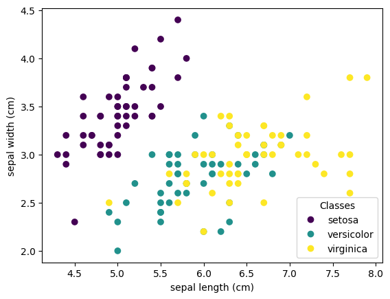
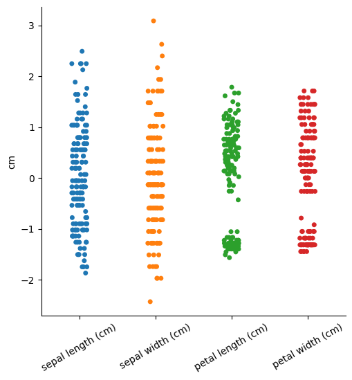

# Sieć klasyfikująca irysy

## Opis projektu

Ten projekt demonstruje budowę i trenowanie prostej sieci neuronowej do klasyfikacji irysów na podstawie popularnego zestawu danych `Iris`. Wykorzystano biblioteki takie jak `scikit-learn`, `pandas`, `matplotlib`, `seaborn` oraz `PyTorch` do przetwarzania danych, wizualizacji i budowy modelu.

## Wymagania wstępne

Zainstaluj wymagane biblioteki i utwórz środowisko wirtualne:

```bash
python -m venv .venv
.venv\Scripts\activate
pip install -r requirements.txt
```

## Dane wejściowe

### Import danych
Dane pochodzą z wbudowanego zbioru `load_iris` dostępnego w `sklearn`. Zbiór zawiera:

- **Cechy wejściowe**: długość i szerokość działki oraz płatków irysa (cm).
- **Etykiety wyjściowe**: klasy irysów (`setosa`, `versicolor`, `virginica`).

### Wizualizacja danych
Dane są wizualizowane na wykresie:
### Wizualizacja danych

Dane są wizualizowane na poniższym wykresie, który przedstawia długość i szerokość działek irysów z oznaczeniem ich klasy:




### Przetwarzanie danych
- **Standaryzacja**: Dane wejściowe są centrowane i skalowane do średniej 0 i wariancji 1.  

- **One-hot encoding**: Etykiety wyjściowe są przekształcane na format binarny.

### Podział danych
Dane są podzielone na zbiór treningowy (80%) i testowy (20%) za pomocą `train_test_split`.

## Model

### Architektura sieci
Sieć neuronowa została zdefiniowana w `PyTorch` jako 3-warstwowy model:

- Warstwa 1: 4 wejścia → 10 neuronów
- Warstwa 2: 10 wejść → 100 neuronów
- Warstwa 3: 100 wejść → 3 wyjścia (klasy)

```python
class NeuralNet(nn.Module):
    def __init__(self):
        super(NeuralNet, self).__init__()
        self.fc1 = nn.Linear(4, 10)
        self.fc2 = nn.Linear(10, 100)
        self.fc3 = nn.Linear(100, 3)

    def forward(self, x):
        x = torch.relu(self.fc1(x))
        x = torch.relu(self.fc2(x))
        x = torch.softmax(self.fc3(x), dim=1)
        return x
```

### Trening sieci
Model jest trenowany przez 100 epok z optymalizatorem `Adam` i funkcją błędu `CrossEntropyLoss`. Gradienty są obliczane i aktualizowane dla każdej paczki danych.

### Walidacja
Dokładność modelu jest mierzona na danych testowych. Wynik na przykładzie:

```
Dokładność modelu na podstawie danych poprawnych: 96.67%
```

## Jak uruchomić projekt?

1. Uruchom środowisko wirtualne:
   ```bash
   .venv\Scripts\activate
   ```

2. Uruchom skrypt:
   ```bash
   python main.py
   ```

3. Zobacz wyniki na konsoli i wizualizacje w wygenerowanych wykresach.

## Wyniki

Model osiąga wysoką dokładność na zbiorze testowym, co wskazuje na skuteczność w klasyfikacji irysów przy zastosowanej architekturze i przetwarzaniu danych.

## Dalsze kroki

- Eksperymentowanie z hiperparametrami (liczba neuronów, funkcja aktywacji, itp.).
- Użycie innych funkcji optymalizacji lub metryk oceny.
- Rozbudowa sieci o inne warstwy (np. dropout, batch normalization).